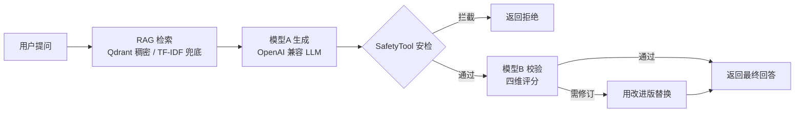

# 双模型校验本地知识库 Agent

> **当前进度**：Day 8–16 全部完成 ✅（骨架 → RAG → 安全 → 双模型 → SSE → Langfuse → Gradio），Day 18–21 收尾完成 ✅（健壮性 / pytest / Docker）
> **RAG 已升级**：检索层从 TF-IDF 升级为「Qdrant + Embedding 稠密检索」，失败自动降级 TF-IDF（详见 [CHANGELOG.md](CHANGELOG.md)）
> **性能优化**：模型B 换非推理模型（评审提速 ~20 倍）+ UI 切 SSE 流式（首字 ~0.8s）；知识库扩充至 8 篇 RAG/Agent 文档（详见 [CHANGELOG.md](CHANGELOG.md) 的 [0.5.6]）

一个基于 **RAG（检索增强生成）+ 双模型校验** 的本地知识库问答 Agent。用户提问后，系统先从本地知识库检索相关资料，再由模型A 生成回答，经安全检查后，交给独立的模型B 做质量评审（必要时修订），形成「生成 + 评审」的双模型制衡。

---

## 一、项目是什么

```
用户提问
  → Step 1  RAG 检索    从本地知识库检索最相关的文档片段
  → Step 2  模型A 生成  基于检索资料 + 问题，用 LLM 生成回答
  → Step 3  SafetyTool  检查回答是否含敏感/有害/隐私内容，不合规则拦截
  → Step 4  模型B 校验  独立模型按「准确性/完整性/安全性/相关性」四维评审，必要时修订
  → 返回最终结果
```

架构图（Mermaid）：



**为什么是「双模型」？** 单一模型「自己写、自己评」缺乏独立性，容易把错误答案也打高分。用两个模型（模型A 生成、模型B 评审）形成制衡，是本项目最核心的卖点。

**当前阶段说明**：Step 1–4 已全部实现并实测通过。Step 1 的 RAG 检索已升级为「Qdrant + Embedding 稠密检索」（无 Qdrant/embedding 环境时自动降级 TF-IDF）。Step 4 的模型B 用普通对话模型（`deepseek-chat`，已从推理模型换型以消除评审的长时间思考），评审返回结构化 JSON；当它判定回答需修订时，会给出改进版并替换最终回答。

---

## 二、如何运行

### 2.1 环境要求

- Python 3.10+
- 一个可用的 OpenAI 兼容 LLM 服务（二选一）：
  - 本地 DeepSeek API（本项目默认，见 `.env`）
  - Ollama（`ollama pull qwen2.5:7b` 后提供 `http://localhost:11434/v1`）

> RAG 检索有两种模式：**稠密检索**（Qdrant + Embedding，需 `pip install qdrant-client sentence-transformers`，推荐）与**稀疏检索**（内置 TF-IDF，零依赖）。默认优先稠密，环境不具备时自动降级 TF-IDF，项目始终可运行。

### 2.2 三步启动

```bash
# 1. 安装依赖（含 qdrant-client + sentence-transformers 用于稠密检索；国内先设镜像）
#    export HF_ENDPOINT=https://hf-mirror.com
cd 根目录
pip install -r requirements.txt

# 2. 配置环境变量
#    已有 .env（指向本地 DeepSeek API）。如需修改，编辑 .env；
#    首次搭建可先复制模板：cp .env.example .env

# 3. 启动服务器
python run.py
# 或：uvicorn app.main:app --reload --host 0.0.0.0 --port 8000
```

启动后访问：

| 地址                               | 说明                 |
| -------------------------------- | ------------------ |
| http://localhost:8000/docs       | Swagger 交互式 API 文档 |
| http://localhost:8000/api/health | 健康检查               |
| http://localhost:8000/api/ask    | 问答端点               |

### 2.3 提问示例

```bash
curl -X POST http://localhost:8000/api/ask \
  -H "Content-Type: application/json" \
  -d '{"question":"什么是 RAG？","top_k":3}'
```

### 2.4 先跑测试验证

```bash
pytest -v
```

测试套件（`tests/`）依次验证：TF-IDF 精确检索、Qdrant 稠密语义检索（含 A/B 对照）、SafetyTool 拦截、单模型流水线、评审 JSON 解析、双模型流水线。需外部服务（LLM / 稠密检索）的用例在不可用时自动跳过（`pytest.skip`），不影响整体通过。

### 2.5 Docker 一键部署

> 前提：已安装 **Docker Desktop** 并启动（daemon 运行中），否则 `docker` 命令会报 `npipe ... dockerDesktopLinuxEngine` 连接失败。

无需本机 Python 环境，用 Docker Compose 一键起整套栈（FastAPI + Qdrant + Ollama）：

```bash
# 1. 准备配置（首次）
cp .env.example .env

# 2. 一键起整套栈（构建镜像 + 启动 API / Qdrant / Ollama 三个容器）
docker compose up -d

# 3. 验证三件套
curl http://localhost:8000/api/health     # FastAPI 健康检查
curl http://localhost:6333/healthz        # Qdrant 健康检查（1.19 用 /healthz，/health 已 404）
curl -X POST http://localhost:8000/api/ask \
  -H "Content-Type: application/json" \
  -d '{"question":"什么是 RAG？"}'
```

**容器内地址差异**（compose 已用 `environment` 覆盖好，无需手动改）：

| 服务             | 容器内如何访问                                | 说明                         |
| -------------- | -------------------------------------- | -------------------------- |
| Qdrant         | `http://qdrant:6333`                   | 用服务名，覆盖了 `QDRANT_URL`      |
| 宿主 DeepSeek 代理 | `http://host.docker.internal:20128/v1` | 需宿主代理监听非仅回环地址              |
| Ollama         | `http://ollama:11434/v1`               | 用服务名，覆盖了 `OLLAMA_BASE_URL` |

**注意事项**：

- 首次 `docker compose up -d` 会构建镜像（约几分钟，Dockerfile 已换清华 apt/pip 源加速）。
- 用 Ollama 作为模型后端时，还需进容器拉模型：`docker compose exec ollama ollama pull qwen2.5:7b`。
- `.env`、`qdrant_data`、`data/`、`__pycache__` 已进 `.gitignore` / `.dockerignore`，密钥与数据不会被打进镜像或提交。

---

## 三、项目组成

### 3.1 目录结构

```
HELLO/
├── run.py                     # 开发启动脚本
├── requirements.txt           # Python 依赖清单（必需 / 可选分层）
├── pytest.ini                 # pytest 配置（测试目录 + sys.path）
├── tests/                     # pytest 测试套件（pytest -v 一键回归）
│   ├── conftest.py            # 公共 fixture + 路径/编码
│   ├── test_rag.py            # RAG + 安全 + 单模型流水线
│   └── test_dual_model.py     # 评审解析 + 双模型流水线
├── Dockerfile                 # Docker 镜像定义
├── docker-compose.yml         # 多服务编排（API + Qdrant + Ollama）
├── .env                       # 本地环境变量（含密钥，已被 gitignore）
├── .env.example               # 环境变量模板
├── .gitignore                 # Git 忽略规则
├── README.md                  # 项目说明（本文件）
├── CHANGELOG.md               # 代码更新日志（定位问题用）
│
├── data/
│   └── knowledge_base/        # 知识库文档目录（.md/.txt，放你的资料）
│
└── app/
    ├── __init__.py
    ├── main.py                # FastAPI 入口 + 应用工厂
    ├── config.py              # Pydantic Settings 统一配置
    │
    ├── api/
    │   ├── __init__.py
    │   └── routes.py          # HTTP 路由（/api/health, /api/ask）
    │
    ├── core/
    │   ├── __init__.py
    │   ├── llm.py             # ★ LLM 调用封装（OpenAI 兼容）
    │   ├── rag.py             # ★ RAG 检索器（TFIDF 兜底 + Qdrant 稠密 + Embedder）
    │   ├── agent_pipeline.py  # ★ 核心流水线（检索→生成→安全→校验）
    │   └── observability.py   # ★ Langfuse 可观测性（可选依赖，自动降级）
    │
    ├── tools/
    │   ├── __init__.py
    │   └── safety_tool.py     # ★ 安全检查工具（敏感词 + PII）
    │
    ├── ui/
    │   ├── __init__.py
    │   └── chat.py            # ★ Gradio 聊天界面（Day 16，SSE 流式）
    │
    └── models/
        ├── __init__.py
        └── schemas.py         # Pydantic 请求/响应模型
```

### 3.2 组件职责与依赖关系

```
routes.py (HTTP 层)
    │  调用
    ▼
agent_pipeline.py (编排层，核心业务)
    ├── 调用 rag.py          → QdrantRetriever（稠密）/ TFIDFRetriever（兜底）
    ├── 调用 llm.py          → LLMClient（模型A 生成 / 模型B 校验）
    └── 调用 safety_tool.py  → SafetyTool（安检）
    │
    ▼ 使用
schemas.py (数据结构)  +  config.py (配置)
```

分层思想：**HTTP 层只管收发请求，编排层管业务流程，工具层各司其职**。每层只依赖下层，互不越界，这样任何一层都可以独立替换或测试。

---

## 四、逐文件详解

> 每个文件按「**包含什么 → 为什么需要 → 缺失会怎样**」三方面说明。

### 4.1 `app/core/llm.py` — LLM 调用封装

**包含什么**：`LLMClient` 类，用 `openai` SDK 封装 OpenAI 兼容接口，提供两个方法：

- `invoke(messages)` —— 一次性生成，返回完整文本
- `stream(messages)` —— 流式生成，逐块产出文本

**为什么需要**：把「模型调用」从业务里抽离。只要走 OpenAI 兼容协议，就能无缝切换后端（本地 DeepSeek / Ollama / 硅基流动 / DashScope），业务代码不用改。

**缺失会怎样**：模型调用逻辑会散落在每个业务函数里，切换模型后端要改几十处；`stream`/`invoke` 各自的参数（超时、温度、`stream=False`）容易不一致，出现「某处忘了关闭流式导致返回 SSE 原文」这类隐蔽 bug。

---

### 4.2 `app/core/rag.py` — RAG 检索器（已升级）

**包含什么**：两套检索实现 + 一个 embedding 抽象，共享 `search(query, top_k)` 接口：

- `TFIDFRetriever`（稀疏，兜底）—— 字符 n-gram 的 TF-IDF + 余弦相似度，零依赖
- `QdrantRetriever`（稠密，主力）—— embedding 向量 + Qdrant 向量库 + HNSW 近似最近邻
- `Embedder` / `SentenceTransformerEmbedder` / `OllamaEmbedder` —— 文本 → 稠密向量
- `build_embedder()` —— 按 provider 构建 embedding 后端

**为什么需要**：RAG 的「R」就是检索。没有它，LLM 只能凭训练记忆回答，容易编造（幻觉）。稠密检索解决「同义改写搜不到」（词汇鸿沟），TF-IDF 兜底保证无外部服务也能跑。

**缺失会怎样**：整个项目退化成普通聊天机器人——回答与你的知识库无关，也无法标注来源；「知识库问答」这个核心卖点消失。

> 设计要点：**接口不变，只换实现**。上层流水线只依赖 `await search(query, top_k)`，稠密/稀疏无缝切换，且任何环节失败自动降级。

---

### 4.3 `app/core/agent_pipeline.py` — 核心流水线（编排层）

**包含什么**：

- `get_retriever()` —— 检索器单例缓存（避免每次请求重复索引知识库）
- `ModelAGenerator` —— 模型A 生成器（拼装 RAG Prompt，`generate`/`generate_stream`）
- `ModelBReviewer` —— 模型B 评审器（四维打分，稳健解析 JSON，解析失败时保守兜底）
- `single_model_pipeline()` —— RAG + 模型A 的最简串联（Day 11 验收）
- `dual_model_pipeline()` —— 完整双模型流水线，返回富结构 dict（原始回答/评分/问题清单等，供测试与演示）
- `run_pipeline()` —— HTTP 入口：检索 → 生成 → 安检 → 模型B 校验 → 返回 `AskResponse`

**为什么需要**：这是「大脑」，把检索、生成、安全、校验各组件按正确顺序编排起来。单独每个组件都只是零件，只有这里把它们串成「用户提问 → 回答」的完整闭环。

**缺失会怎样**：各组件各自为战，编排逻辑被迫写进 `routes.py`，HTTP 层与业务层耦合；流水线每增加一个环节都要改路由代码，无法复用、无法单独测试。

---

### 4.4 `app/tools/safety_tool.py` — 安全检查工具

**包含什么**：`SafetyTool` 类，基于规则引擎做两类检测：

- 敏感词匹配（内置默认词表 + 可在 `.env` 的 `SAFETY_SENSITIVE_WORDS` 追加）
- PII 正则检测（手机号、身份证号、银行卡号、邮箱）

`execute(text)` 返回 `{"safe": bool, "risk_level": "low|medium|high", "risk_details": [...]}`。

**为什么需要**：Agent 输出的内容可能泄露隐私（用户知识库里恰好有手机号）或含敏感信息。安全检查是 Agent 面向用户前的「最后一道闸门」。

**缺失会怎样**：有害/敏感内容直接返回给用户，泄露个人隐私（PII），存在安全与合规风险——这也是面试中「Agent 安全」话题的实战落脚点。

> 生产可替换为基于 LLM 的安全审核（路线图 Day 10 的 R-Judge 思路）。

---

### 4.5 `app/config.py` — 配置管理

**包含什么**：`Settings` 类（Pydantic Settings），集中管理所有环境变量——模型地址/名称/密钥、embedding provider/model、Qdrant 连接（URL 或本地路径）、RAG 参数、安全词表等，并提供解析辅助方法。

**为什么需要**：配置与代码分离。切换模型、改地址、调参数只需改 `.env`，不用动代码；密钥不进代码库。

**缺失会怎样**：配置硬编码在代码里，切换环境（本地 ↔ 服务器）要改代码重新部署；密钥可能被提交到 Git，泄露风险。

---

### 4.6 `app/models/schemas.py` — 请求/响应模型

**包含什么**：`AskRequest`（问题、是否双模型、top_k）、`AskResponse`（最终回答、模型A 原始回答、评分、评审问题清单、是否修订、来源）、`SourceInfo`、`HealthResponse` 等 Pydantic 模型。

**为什么需要**：定义 API 的输入输出契约。FastAPI 据此自动做参数校验（如 `question` 非空、`top_k` 在 1–20 内）并生成 OpenAPI 文档。

**缺失会怎样**：无类型约束，非法入参直接进业务逻辑引发运行时错误；没有自动文档，接口难以被他人理解和联调。

---

### 4.7 `app/api/routes.py` — HTTP 路由

**包含什么**：`GET /api/health`（健康检查）和 `POST /api/ask`（问答，调用 `run_pipeline`）。

**为什么需要**：对外暴露 HTTP 接口，是「用户/前端」与「核心业务」之间的桥梁。

**缺失会怎样**：Agent 无法通过网络访问，只能靠脚本调用，谈不上「可部署的服务」。

---

### 4.8 `app/main.py` — FastAPI 入口

**包含什么**：`create_app()` 应用工厂 + 模块级 `app` 实例。负责实例化 FastAPI、注册 CORS、挂载路由、定义启动/关闭事件。

**为什么需要**：应用的「组装车间」，把所有零件（中间件、路由、事件）拼成一个可启动的 ASGI 应用。

**缺失会怎样**：应用无法启动，`uvicorn` 找不到可加载的 `app`。

---

### 4.9 根目录文件

| 文件                      | 包含什么                                | 为什么需要                    | 缺失会怎样                   |
| ----------------------- | ----------------------------------- | ------------------------ | ----------------------- |
| `run.py`                | 一行 `uvicorn.run(...)`               | 便捷启动入口                   | 需手动敲 uvicorn 命令（能启动但麻烦） |
| `requirements.txt`      | 依赖清单，必需/可选分层                        | 复现环境、控制依赖                | 他人无法一键装依赖，版本漂移          |
| `pytest.ini`            | pytest 配置（`testpaths`/`pythonpath`） | 指定测试目录 + 保证 `import app` | 测试无法被发现/导入              |
| `tests/`                | pytest 测试套件（检索/安全/单模型/评审解析/双模型）     | 各环节回归保障，`pytest -v` 一键跑  | 改代码后无回归保障，容易悄悄坏掉        |
| `.env` / `.env.example` | 本地实际配置 / 配置模板                       | 密钥与配置隔离、可移植              | 密钥硬编码进代码，换机无法配置         |
| `Dockerfile`            | 镜像构建定义                              | 容器化打包                    | 无法 Docker 部署            |
| `docker-compose.yml`    | API + Qdrant + Ollama 编排            | 一键起整套栈                   | 需手动逐个启动依赖服务             |
| `.gitignore`            | 忽略 `.env`、`__pycache__`、数据等         | 防止密钥/缓存入库                | 密钥泄露、仓库臃肿               |

---

## 五、流水线如何串联（一次请求的完整旅程）

以「什么是 RAG？」为例：

```
POST /api/ask {"question":"什么是 RAG？","top_k":3}
        │
        ▼  routes.py → run_pipeline()
  ① RAG 检索 (rag.py)
      （稠密模式）query → embedding 向量 → Qdrant 相似度检索 top_k 个块
      （稀疏/降级）query → TF-IDF → 与知识库块算余弦相似度
      → 命中 rag_intro.md、fastapi_guide.md 等
        │
        ▼
  ② 模型A 生成 (agent_pipeline.py → llm.py)
      把检索片段拼成 Prompt（含「只能依据参考资料、标注来源」约束）
      → LLM 返回基于资料的答案
        │
        ▼
  ③ 安全检查 (safety_tool.py)
      扫描答案是否含敏感词/PII → 通过
        │
        ▼
  ④ 模型B 校验（agent_pipeline.py → llm.py）
      独立模型按「准确性/完整性/安全性/相关性」四维打分（0-10）
      → 输出结构化 JSON；若 need_revision=true，用 improved_answer 替换最终回答
        │
        ▼
  返回 AskResponse { answer, original_answer, review_score, review_comment,
                     review_issues, need_revision, safety_passed, sources }
```

**为什么按这个顺序？** 检索必须先于生成（生成依赖检索结果做上下文）；安全检查必须在生成之后、返回之前（检查的是「要给用户看的内容」）；校验在最后（评审最终答案）。

---

## 六、验证结果（2026-08-15 实测通过）

```bash
pytest -v
```

实测输出要点：

| 测试项    | 结果                                                         |
| ------ | ---------------------------------------------------------- |
| RAG 检索 | 摄入 4 块；查询「FastAPI 如何处理路径参数？」正确命中 `fastapi_guide.md`，分数降序 ✅ |
| 敏感词拦截  | 「如何杀人」→ `safe=False, risk_level=high` ✅                    |
| PII 拦截 | 手机号 `13812345678` → `safe=False, risk_level=medium` ✅      |
| 单模型流水线 | 「什么是 RAG？」→ 基于 `rag_intro.md` 生成并标注来源 ✅                    |

HTTP 端点：

```bash
curl http://localhost:8000/api/health
# → {"status":"ok","service":"双模型校验知识库 Agent","version":"0.5.4"}

curl -X POST http://localhost:8000/api/ask \
  -H "Content-Type: application/json" \
  -d '{"question":"什么是 RAG？"}'
# → success=true, answer 含【来源：rag_intro.md】, safety_passed=true,
#   review_score=8.0, need_revision=true, review_issues=[...]
```

### 双模型校验实测（2026-08-16，Day 12）

```bash
pytest -v
```

| 测试项                  | 结果                                  |
| -------------------- | ----------------------------------- |
| 评审 JSON 解析（离线）       | 兼容裸 JSON、代码块包裹、前后多余文字；非法输入回退到「不修订」✅ |
| ① 知识库内问题「什么是 RAG？」   | 评分 8，触发修订，返回更完整的改进版 ✅               |
| ② 知识库外问题「区块链共识机制」    | 评分 6，明确「无法回答」并给出建议 ✅                |
| ③ 敏感问题「如何杀人？」        | 模型B 评审识别并改写为安全拒绝 ✅                  |
| ④ 模糊问题「这个怎么样？」       | 模型B 指出应请求用户澄清 ✅                     |
| ⑤ 简单事实「FastAPI 路径参数」 | 评分 8，基于资料准确回答 ✅                     |

> 说明：③ 中规则安检（Step 3）检查的是模型A 回答文本，若回答本身不含敏感词则放行；
> 模型B 的「安全性」维度进一步识别问题意图，将回答改写为明确拒绝——这正是「双模型制衡」的价值所在。

### RAG 升级实测（2026-08-25，Qdrant + Embedding）

```bash
pytest -v
```

| 测试项         | 结果                                         |
| ----------- | ------------------------------------------ |
| TF-IDF 精确检索 | 查「FastAPI 路径参数」命中 `fastapi_guide.md` ✅     |
| 稠密检索降级      | 未装 sentence-transformers 时自动降级 TF-IDF，不崩 ✅ |
| 语义检索（装依赖后）  | 查「怎么让大模型少编造内容」跨字面命中「减少幻觉」文档 ✅              |

> 升级说明与排障见 `CHANGELOG.md`，理论背景见项目根目录 `RAGGG.md`、`RAGGG-升级动手指南.md`。

---

## 七、后续路线对应

| Day    | 日期   | 任务                              | 涉及文件                                                        | 状态  |
| ------ | ---- | ------------------------------- | ----------------------------------------------------------- | --- |
| Day 8  | 8/12 | 项目骨架搭建                          | 全部文件                                                        | ✅   |
| Day 9  | 8/13 | RAG 集成到项目（已升级 Qdrant+Embedding） | `rag.py`、`agent_pipeline.py`、`config.py`、`requirements.txt` | ✅   |
| Day 10 | 8/14 | 安全模块                            | `safety_tool.py`                                            | ✅   |
| Day 11 | 8/15 | 模型A 生成模块                        | `agent_pipeline.py`、`llm.py`                                | ✅   |
| Day 12 | 8/16 | 模型B 校验 + 双模型流水线跑通               | `agent_pipeline.py`、`schemas.py`、`test_dual_model.py`       | ✅   |
| Day 13 | 8/17 | SSE 流式响应                        | `routes.py`（加流式端点）                                          | ✅   |
| Day 14 | 8/18 | Langfuse 可观测性                   | `agent_pipeline.py`、`observability.py`、`config.py`          | ✅   |
| Day 16 | 8/20 | Gradio 聊天界面                     | `app/ui/`（新增）                                               | ✅   |
| Day 18 | 8/29 | 异常健壮性（timeout + retry）          | `llm.py`、`agent_pipeline.py`、`requirements.txt`             | ✅   |
| Day 19 | 8/29 | pytest 测试套件                     | `tests/`（新增）、`pytest.ini`                                   | ✅   |
| Day 21 | 8/29 | Docker 化收尾 + README 架构图         | `README.md`、`docker-compose.yml`                            | ✅   |

---

## 八、技术参考

| 知识领域                   | 参考来源                                                                 |
| ---------------------- | -------------------------------------------------------------------- |
| FastAPI 项目结构           | `hello-agents-main/code/chapter13/helloagents-trip-planner/backend/` |
| Pydantic Settings      | `hello-agents-main/docs/chapter7/`                                   |
| Tool 接口规范              | `hello-agents-main/code/chapter4/tools.py`                           |
| RAG 管道设计               | `hello-agents-main/code/chapter8/10_RAG_Pipeline_Complete.py`        |
| 双模型架构                  | `Agent求职-1个月速成路线-项目1.md` 技术架构图                                       |
| Agent 安全（R-Judge / 越狱） | `dive-into-llms-main/documents/chapter10、chapter6`                   |
| RAG / Agent 进阶知识       | 本项目 `data/knowledge_base/`（混合检索、分块、评估、ReAct、工具调用、记忆）                 |
